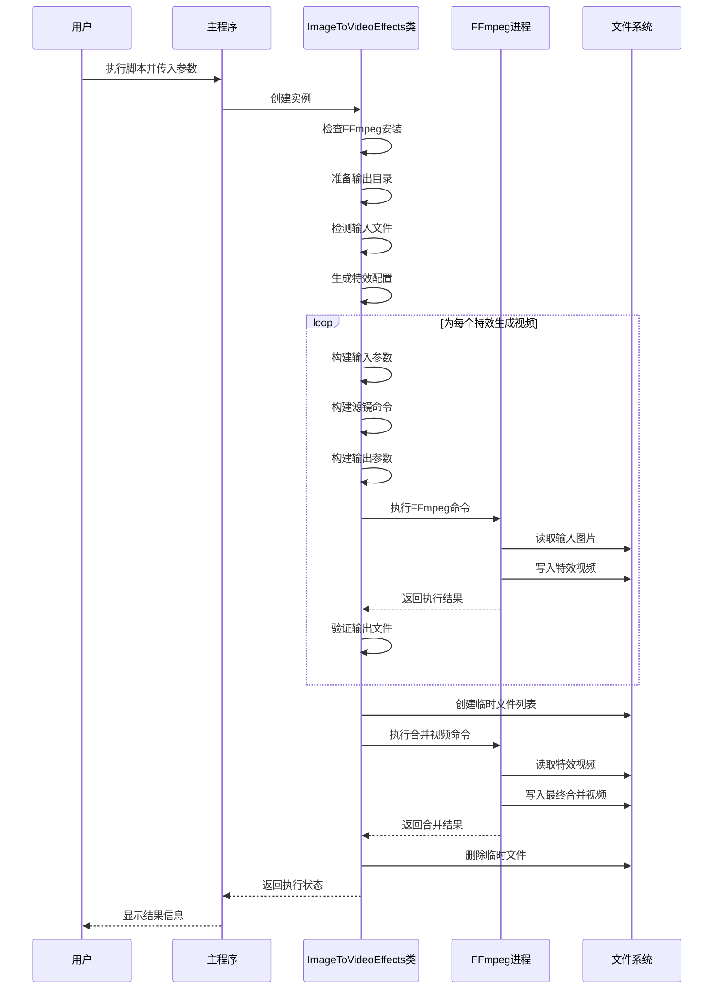

# 图片转视频特效工具技术实现方案

## 1. 概述

本技术文档详细描述了`image_to_video_effects_commented.py`脚本的核心实现原理、功能架构、工作流程和关键算法，该工具能够将图片序列转换为具有多种视觉特效的视频文件。

## 2. 系统架构

### 2.1 核心组件

该工具采用面向对象的设计模式，主要由`ImageToVideoEffects`类组成，封装了所有图片转视频特效的核心功能。

```python
class ImageToVideoEffects:
    def __init__(self, input_pattern, output_dir=None, fps=25, duration=16.0, output_size='1280x720'):
        # 初始化配置和环境检查
        self._check_ffmpeg_installed()
        self.input_pattern = input_pattern
        self.output_dir = self._prepare_output_dir(output_dir)
        self.fps = fps
        self.duration = duration
        self.output_size = output_size
        self.input_files = self._detect_input_set()
        self.effects = self._generate_effect_configs()
        self.generated_videos = []
```

### 2.2 功能模块划分

| 模块名称 | 主要职责 | 核心方法 |
|---------|---------|---------|
| 环境检查模块 | 验证FFmpeg安装、检查输入输出路径 | `_check_ffmpeg_installed()`, `_prepare_output_dir()` |
| 输入处理模块 | 解析输入模式、检测输入文件 | `_detect_input_set()` |
| 特效生成模块 | 定义各种视频特效配置、执行FFmpeg命令 | `_generate_effect_configs()`, `_generate_single_effect()` |
| 视频合并模块 | 将多个特效视频合并为最终视频 | `_merge_videos()` |
| 辅助工具模块 | 创建测试图片 | `create_test_images()` |

## 3. 核心功能实现

### 3.1 初始化与环境检查

初始化过程完成环境验证、参数设置和输入文件检测，确保后续操作能够正常执行。

```python
def __init__(self, input_pattern, output_dir=None, fps=25, duration=16.0, output_size='1280x720'):
    # 检查FFmpeg是否安装
    self._check_ffmpeg_installed()
    
    # 设置输入输出参数
    self.input_pattern = input_pattern
    self.output_dir = self._prepare_output_dir(output_dir)
    self.fps = fps
    self.duration = duration
    self.output_size = output_size
    
    # 检测输入文件
    self.input_files = self._detect_input_set()
    
    # 初始化特效配置列表
    self.effects = self._generate_effect_configs()
    self.generated_videos = []

# 环境检查方法实现
def _check_ffmpeg_installed(self):
    try:
        subprocess.run(['ffmpeg', '-version'], stdout=subprocess.PIPE, stderr=subprocess.PIPE, check=True)
    except (subprocess.SubprocessError, FileNotFoundError):
        raise RuntimeError("未找到FFmpeg，请先安装FFmpeg并确保其在系统PATH中")

# 准备输出目录方法实现
def _prepare_output_dir(self, output_dir):
    if output_dir is None:
        output_dir = Path("effects_output")
    else:
        output_dir = Path(output_dir)
    
    # 创建输出目录（如果不存在）
    output_dir.mkdir(parents=True, exist_ok=True)
    return output_dir
```

### 3.2 输入文件处理机制

该模块支持三种输入模式：
1. 序列模式：如`input%d.jpg`或`output_%03d.jpg`
2. 通配符模式：如`images/*.jpg`
3. 单文件模式：处理单个图片

```python
def _detect_input_set(self):
    # 检测输入文件集合
    input_files = []
    
    # 检查是否为通配符模式
    if any(ch in self.input_pattern for ch in ['*', '?', '[', ']']):
        try:
            input_files = glob.glob(self.input_pattern)
            if not input_files:
                raise ValueError(f"未找到匹配 '{self.input_pattern}' 的文件")
        except Exception as e:
            raise ValueError(f"通配符模式解析错误: {str(e)}")
    
    # 检查是否为序列模式（包含 % 字符）
    elif '%' in self.input_pattern:
        try:
            # 尝试格式化字符串来验证是否为序列模式
            test_path = self.input_pattern % 1
            if os.path.exists(test_path) or ("%0" in self.input_pattern and os.path.exists(self.input_pattern.replace("%03d", "001"))):
                # 这是一个序列模式，我们只需要返回这个模式本身
                input_files = [self.input_pattern]
            else:
                raise ValueError(f"序列模式 '{self.input_pattern}' 无法匹配任何文件")
        except Exception as e:
            # 如果格式化失败，可能不是标准的序列模式
            raise ValueError(f"序列模式解析错误: {str(e)}")
    
    # 否则检查是否为单文件模式
    else:
        if os.path.isfile(self.input_pattern):
            input_files = [self.input_pattern]
        else:
            raise ValueError(f"输入文件 '{self.input_pattern}' 不存在")
    
    return input_files
```

### 3.3 视频特效生成引擎

该模块是整个系统的核心，通过定义各种FFmpeg滤镜组合实现丰富的视频特效。

#### 3.3.1 特效配置机制

```python
def _generate_effect_configs(self):
    # 定义各种视频特效的FFmpeg滤镜配置
    effects = [
        {
            "name": "fade_in_fade_out",
            "description": "淡入淡出效果",
            "filter": f"zoompan=d={self.fps*self.duration}:s={self.output_size}:fps={self.fps},fade=t=in:st=0:d=1,fade=t=out:st={self.duration-1}:d=1"
        },
        {
            "name": "pan_left",
            "description": "水平平移（从左到右）",
            "filter": f"zoompan=d={self.fps*self.duration}:s={self.output_size}:fps={self.fps}:x='if(lte(x,main_w-over_w),x+0.5,x)'"
        },
        {
            "name": "pan_right",
            "description": "水平平移（从右到左）",
            "filter": f"zoompan=d={self.fps*self.duration}:s={self.output_size}:fps={self.fps}:x='if(gte(x,0),x-0.5,x)'"
        },
        {
            "name": "black_and_white",
            "description": "黑白效果",
            "filter": f"zoompan=d={self.fps*self.duration}:s={self.output_size}:fps={self.fps},eq=brightness=0.0:saturation=0.0"
        },
        {
            "name": "sepia",
            "description": "复古褐色效果",
            "filter": f"zoompan=d={self.fps*self.duration}:s={self.output_size}:fps={self.fps},colorchannelmixer=.393:.769:.189:0:.349:.686:.168:0:.272:.534:.131:0"
        },
        {
            "name": "blur",
            "description": "高斯模糊效果",
            "filter": f"zoompan=d={self.fps*self.duration}:s={self.output_size}:fps={self.fps},gblur=sigma=2"
        },
        {
            "name": "text_watermark",
            "description": "文字水印效果",
            "filter": f"zoompan=d={self.fps*self.duration}:s={self.output_size}:fps={self.fps},drawtext=fontfile=Arial.ttf:text='Video Effect':fontcolor=white:fontsize=30:x=10:y=10"
        }
    ]
    return effects

# 生成所有特效的主方法
def generate_all_effects(self):
    print(f"总共要生成 {len(self.effects)} 种特效视频...")
    
    for effect in self.effects:
        self._generate_single_effect(effect)
    
    # 合并所有生成的视频
    if self.generated_videos:
        self._merge_videos()
    else:
        print("没有成功生成任何特效视频，跳过合并步骤")
```

#### 3.3.2 特效执行流程

每个特效的生成遵循以下流程：
1. 构建FFmpeg输入参数
2. 应用特定的滤镜组合
3. 构建输出参数
4. 执行FFmpeg命令
5. 验证输出结果

```python
def _generate_single_effect(self, effect):
    print(f"正在生成 '{effect['description']}'...")
    try:
        output_file = self.output_dir / f"{effect['name']}.mp4"
        # 构建ffmpeg命令
        cmd = [
            "ffmpeg",
            *self._build_input_args(),
            "-vf", effect["filter"],
            *self._build_output_args(output_file)
        ]
        # 执行ffmpeg命令
        result = subprocess.run(
            cmd,
            check=True,
            stdout=subprocess.PIPE,
            stderr=subprocess.PIPE,
            universal_newlines=True
        )
        # 简单校验输出文件确实存在且非空
        if output_file.exists() and os.path.getsize(output_file) > 0:
            print(f"成功生成: {effect['description']}")
            self.generated_videos.append(str(output_file))
        else:
            print(f"生成 '{effect['description']}' 失败: 输出文件不存在或为空")
    except subprocess.CalledProcessError as e:
        print(f"生成 '{effect['description']}' 失败:")
        print(f"错误信息: {e.stderr}")
        print(f"继续处理下一个特效...")
    except Exception as e:
        print(f"生成 '{effect['description']}' 时发生未知错误:")
        print(f"错误信息: {str(e)}")
        print(f"继续处理下一个特效...")

# 构建输入参数方法
def _build_input_args(self):
    input_args = ["-y"]  # 覆盖输出文件
    
    # 检查是否为序列模式
    if len(self.input_files) == 1 and "%" in self.input_files[0]:
        # 序列模式
        input_args.extend(["-f", "image2", "-i", self.input_files[0]])
    elif len(self.input_files) > 1:
        # 多个文件模式（通常是通配符匹配的结果）
        # 对于多个文件，我们假设FFmpeg可以按顺序处理它们
        input_args.extend(["-f", "image2", "-i", self.input_pattern])
    else:
        # 单个文件模式
        input_args.extend(["-i", self.input_files[0]])
    
    return input_args

# 构建输出参数方法
def _build_output_args(self, output_file):
    # 构建基本输出参数
    output_args = [
        "-c:v", "libx264",  # 使用H.264编码器
        "-preset", "medium", # 预设编码速度和压缩率的平衡
        "-crf", "23",        # 恒定质量因子（0-51，越低质量越好）
        "-pix_fmt", "yuv420p", # 像素格式，确保广泛兼容性
        "-r", str(self.fps),  # 输出帧率
        str(output_file)       # 输出文件路径
    ]
    
    return output_args
```

### 3.4 视频合并机制

将所有生成的特效视频合并为一个最终的视频文件，使用FFmpeg的concat协议实现高效合并。

```python
def _merge_videos(self):
    print("开始合并所有视频...")
    
    # 创建临时文件列表
    with tempfile.NamedTemporaryFile(mode='w', delete=False, suffix='.txt', encoding='utf-8') as f:
        for video in self.generated_videos:
            f.write(f"file '{os.path.abspath(video)}'\n")
        temp_list_file = f.name
    
    # 合并视频的输出路径
    final_output = self.output_dir / "final_merged_effects.mp4"
    
    # 构建合并视频的ffmpeg命令
    merge_command = [
        "ffmpeg",
        "-y",                      # 覆盖输出文件
        "-f", "concat",           # 使用concat协议
        "-safe", "0",             # 允许使用绝对路径
        "-i", temp_list_file,      # 输入文件列表
        "-c", "copy",             # 直接复制流，不重新编码
        str(final_output)           # 输出文件路径
    ]
    
    try:
        # 执行合并命令
        subprocess.run(
            merge_command,
            check=True,
            stdout=subprocess.PIPE,
            stderr=subprocess.PIPE,
            universal_newlines=True
        )
        print(f"成功合并所有视频到: {final_output}")
    except subprocess.CalledProcessError as e:
        print(f"合并视频失败:")
        print(f"错误信息: {e.stderr}")
    except Exception as e:
        print(f"合并视频时发生未知错误:")
        print(f"错误信息: {str(e)}")
    finally:
        # 清理临时文件
        if os.path.exists(temp_list_file):
            os.unlink(temp_list_file)
```

## 4. 主要特效技术实现

### 4.1 Ken Burns 缩放效果

Ken Burns效果通过`zoompan`滤镜实现，该滤镜能够在保持视频流畅的同时，实现平滑的缩放和移动效果，为静态图片带来动态感。

```python
{
    "name": "ken_burns",
    "description": "Ken Burns 缩放效果",
    "filter": f"zoompan=d={self.fps*self.duration}:s={self.output_size}:fps={self.fps}:z='zoom+0.001',fade=t=in:st=0:d=1,fade=t=out:st={self.duration-1}:d=1"
}
```

Ken Burns效果的技术原理：
- `zoompan`滤镜用于实现缩放和移动效果
- `d`参数设置总帧数（帧率×时长）
- `z='zoom+0.001'`定义缩放因子随时间线性增长
- 结合`fade`滤镜实现平滑的淡入淡出过渡

### 4.2 高级综合特效

该特效结合了缩放、淡入淡出和文字水印等多种效果，展示了如何组合使用FFmpeg滤镜。

```python
{
    "name": "advanced_zoom_and_text",
    "description": "高级缩放与文字叠加",
    "filter": f"zoompan=d={self.fps*self.duration}:s={self.output_size}:fps={self.fps}:z='zoom+0.001',fade=t=in:st=0:d=1,fade=t=out:st={self.duration-1}:d=1,drawtext=fontfile=Arial.ttf:text='Video Effect':fontcolor=white:fontsize=40:x=(w-text_w)/2:y=(h-text_h)/2:enable='between(t,2,5)'"
}
```

此特效的特点：
- 结合了Ken Burns缩放和淡入淡出效果
- 添加了居中显示的文字水印
- 使用`enable='between(t,2,5)'`参数控制文字只在特定时间段（2-5秒）显示
- `x=(w-text_w)/2:y=(h-text_h)/2`计算并设置文字的居中位置

### 4.3 镜像效果

镜像效果使用`split`、`hflip`和`hstack`滤镜组合实现，能够创建图片的镜像副本并水平排列。

```python
{
    "name": "mirror_effect",
    "description": "镜像效果",
    "filter": f"split=2[s0][s1];[s0]hflip[s0h];[s0h][s1]hstack,fade=t=in:st=0:d=1,fade=t=out:st={self.duration-1}:d=1"
}
```

镜像效果的实现流程：
1. `split=2[s0][s1]`将输入视频流复制为两个流[s0]和[s1]
2. `[s0]hflip[s0h]`对第一个流应用水平翻转滤镜
3. `[s0h][s1]hstack`将翻转后的流和原始流水平堆叠
4. 添加淡入淡出效果提升视觉体验

### 4.4 其他特效实现

以下是其他特效的实现代码与技术说明：

#### 4.4.1 快进效果

```python
{
    "name": "fast_forward",
    "description": "快进效果",
    "filter": f"zoompan=d={self.fps*self.duration}:s={self.output_size}:fps={self.fps},setpts=0.5*PTS"
}
```
- `setpts=0.5*PTS`将视频播放速度提高一倍

#### 4.4.2 马赛克像素化效果

```python
{
    "name": "pixelate",
    "description": "马赛克像素化效果",
    "filter": f"zoompan=d={self.fps*self.duration}:s={self.output_size}:fps={self.fps},scale=iw/10:ih/10:flags=neighbor,scale=iw*10:ih*10:flags=neighbor"
}
```
- 通过两次缩放操作实现像素化效果：先缩小再放大
- `flags=neighbor`参数确保在缩放过程中保持像素块的锐利边缘

#### 4.4.3 自定义缩放轨迹

```python
{
    "name": "custom_zoom_path",
    "description": "自定义缩放轨迹",
    "filter": f"zoompan=d={self.fps*self.duration}:s={self.output_size}:fps={self.fps}:x='(in_w-out_w)/2*(1+sin(t/5))':y='(in_h-out_h)/2*(1+cos(t/5))':z='1.2+0.3*sin(t/3)'"
}
```
- 使用三角函数定义平滑的缩放和移动轨迹
- `x`和`y`参数控制水平和垂直位置
- `z`参数控制缩放比例

## 5. 工作流程与时序图

### 5.1 整体工作流程

1. **初始化阶段**：检查环境、设置参数、检测输入文件
2. **特效配置阶段**：生成特效配置列表
3. **特效生成阶段**：逐一执行每个特效的FFmpeg命令
4. **视频合并阶段**：将所有特效视频合并为最终视频
5. **清理阶段**：删除临时文件

### 5.2 时序图

下面使用Mermaid图表展示系统的完整工作流程：



### 5.3 数据流程图

```mermaid
digraph G {
    subgraph 输入层
        A[图片文件序列] --> B[输入参数解析]
        C[命令行参数] --> B
    }
    
    subgraph 处理层
        B --> D[环境与配置初始化]
        D --> E[特效配置生成]
        E --> F[FFmpeg命令构建]
        F --> G[FFmpeg进程执行]
    
        subgraph 特效生成循环
            G --> H[滤镜应用]
            H --> I[视频编码]
            I --> J[临时视频文件]
        end
    
        J --> K[视频合并]
    
    }
    
    subgraph 输出层
        K --> L[最终视频文件]
        L --> M[结果反馈]
    
    }
    
    click A "查看输入文件"
    click L "查看输出文件"
}
```

## 6. 关键算法与技术点

### 6.1 输入文件检测算法

该算法支持三种输入模式的检测，确保工具能够处理各种常见的图片输入场景：

```python
def _detect_input_set(self):
    # 检测输入文件集合
    input_files = []
    
    # 检查是否为通配符模式
    if any(ch in self.input_pattern for ch in ['*', '?', '[', ']']):
        try:
            input_files = glob.glob(self.input_pattern)
            if not input_files:
                raise ValueError(f"未找到匹配 '{self.input_pattern}' 的文件")
        except Exception as e:
            raise ValueError(f"通配符模式解析错误: {str(e)}")
    
    # 检查是否为序列模式（包含 % 字符）
    elif '%' in self.input_pattern:
        try:
            # 尝试格式化字符串来验证是否为序列模式
            test_path = self.input_pattern % 1
            if os.path.exists(test_path) or ("%0" in self.input_pattern and os.path.exists(self.input_pattern.replace("%03d", "001"))):
                # 这是一个序列模式，我们只需要返回这个模式本身
                input_files = [self.input_pattern]
            else:
                raise ValueError(f"序列模式 '{self.input_pattern}' 无法匹配任何文件")
        except Exception as e:
            # 如果格式化失败，可能不是标准的序列模式
            raise ValueError(f"序列模式解析错误: {str(e)}")
    
    # 否则检查是否为单文件模式
    else:
        if os.path.isfile(self.input_pattern):
            input_files = [self.input_pattern]
        else:
            raise ValueError(f"输入文件 '{self.input_pattern}' 不存在")
    
    return input_files
```

### 6.2 帧率与时长计算

系统使用帧率和时长参数来控制视频的播放速度和持续时间：
- 视频总帧数 = 帧率 × 时长
- 每个图片的显示帧数 = 总帧数 / 图片数量

例如，对于一组10张图片，帧率为25fps，时长为16秒的配置：
- 视频总帧数 = 25 × 16 = 400帧
- 每张图片显示帧数 = 400 / 10 = 40帧
- 每张图片显示时间 = 40 / 25 = 1.6秒

### 6.3 FFmpeg命令构建技术

系统使用模块化的方法构建FFmpeg命令，主要包括：
- `_build_input_args()`：构建输入参数
- 特效特定的滤镜字符串
- `_build_output_args()`：构建输出参数

```python
def _build_input_args(self):
    input_args = ["-y"]  # 覆盖输出文件
    
    # 检查是否为序列模式
    if len(self.input_files) == 1 and "%" in self.input_files[0]:
        # 序列模式
        input_args.extend(["-f", "image2", "-i", self.input_files[0]])
    elif len(self.input_files) > 1:
        # 多个文件模式（通常是通配符匹配的结果）
        # 对于多个文件，我们假设FFmpeg可以按顺序处理它们
        input_args.extend(["-f", "image2", "-i", self.input_pattern])
    else:
        # 单个文件模式
        input_args.extend(["-i", self.input_files[0]])
    
    return input_args

# 构建输出参数方法
def _build_output_args(self, output_file):
    # 构建基本输出参数
    output_args = [
        "-c:v", "libx264",  # 使用H.264编码器
        "-preset", "medium", # 预设编码速度和压缩率的平衡
        "-crf", "23",        # 恒定质量因子（0-51，越低质量越好）
        "-pix_fmt", "yuv420p", # 像素格式，确保广泛兼容性
        "-r", str(self.fps),  # 输出帧率
        str(output_file)       # 输出文件路径
    ]
    
    return output_args
```

## 7. 错误处理与容错机制

系统实现了多层错误处理机制，确保在各种异常情况下能够提供有用的错误信息并尽可能继续执行：

1. **环境检查错误**：验证FFmpeg安装、输入文件存在性
2. **命令执行错误**：捕获并显示FFmpeg命令执行失败的详细信息
3. **输出验证错误**：检查生成的视频文件是否存在且非空

```python
def _generate_single_effect(self, effect):
    try:
        output_file = self.output_dir / f"{effect['name']}.mp4"
        # 构建ffmpeg命令
        cmd = [
            "ffmpeg",
            *self._build_input_args(),
            "-vf", effect["filter"],
            *self._build_output_args(output_file)
        ]
        # 执行ffmpeg命令
        result = subprocess.run(
            cmd,
            check=True,
            stdout=subprocess.PIPE,
            stderr=subprocess.PIPE,
            universal_newlines=True
        )
        # 简单校验输出文件确实存在且非空
        if output_file.exists() and os.path.getsize(output_file) > 0:
            print(f"成功生成: {effect['description']}")
            self.generated_videos.append(str(output_file))
        else:
            print(f"生成 '{effect['description']}' 失败: 输出文件不存在或为空")
    except subprocess.CalledProcessError as e:
        print(f"生成 '{effect['description']}' 失败:")
        print(f"错误信息: {e.stderr}")
        print(f"继续处理下一个特效...")
    except Exception as e:
        print(f"生成 '{effect['description']}' 时发生未知错误:")
        print(f"错误信息: {str(e)}")
        print(f"继续处理下一个特效...")

# 环境检查的错误处理
def _check_ffmpeg_installed(self):
    try:
        subprocess.run(['ffmpeg', '-version'], stdout=subprocess.PIPE, stderr=subprocess.PIPE, check=True)
    except (subprocess.SubprocessError, FileNotFoundError):
        raise RuntimeError("未找到FFmpeg，请先安装FFmpeg并确保其在系统PATH中")

# 视频合并的错误处理
def _merge_videos(self):
    # ... 前面代码略 ...
    try:
        # 执行合并命令
        subprocess.run(
            merge_command,
            check=True,
            stdout=subprocess.PIPE,
            stderr=subprocess.PIPE,
            universal_newlines=True
        )
        print(f"成功合并所有视频到: {final_output}")
    except subprocess.CalledProcessError as e:
        print(f"合并视频失败:")
        print(f"错误信息: {e.stderr}")
    except Exception as e:
        print(f"合并视频时发生未知错误:")
        print(f"错误信息: {str(e)}")
    finally:
        # 确保临时文件被清理
        if os.path.exists(temp_list_file):
            os.unlink(temp_list_file)
```

## 8. 命令行接口设计

工具提供了友好的命令行接口，支持多种参数配置：

```python
def main():
    

## 9. 代码优化建议

### 9.1 性能优化

1. **并行处理特效**：目前特效是串行生成的，可以考虑使用多线程或多进程并行生成多个特效，提高处理速度

```python
# 优化前：串行处理
def generate_all_effects(self):
    print(f"总共要生成 {len(self.effects)} 种特效视频...")
    
    for effect in self.effects:
        self._generate_single_effect(effect)
    
    # 合并所有生成的视频
    if self.generated_videos:
        self._merge_videos()
    else:
        print("没有成功生成任何特效视频，跳过合并步骤")

# 优化后：并行处理
from concurrent.futures import ThreadPoolExecutor
import threading

def generate_all_effects_parallel(self):
    print(f"总共要生成 {len(self.effects)} 种特效视频...")
    
    # 创建线程池，最大线程数可以根据系统性能调整
    max_workers = min(4, len(self.effects))  # 最多使用4个线程
    
    # 使用线程池并行处理特效
    with ThreadPoolExecutor(max_workers=max_workers) as executor:
        # 提交所有特效生成任务
        futures = [executor.submit(self._generate_single_effect, effect) for effect in self.effects]
        
        # 可选：等待所有任务完成并处理异常
        for future in futures:
            try:
                future.result()  # 这将重新抛出任务中发生的异常
            except Exception as e:
                print(f"并行处理时发生异常: {str(e)}")
    
    # 合并所有生成的视频
    if self.generated_videos:
        self._merge_videos()
    else:
        print("没有成功生成任何特效视频，跳过合并步骤")
```

2. **智能缓存机制**：对于已经生成过的特效视频，可以添加缓存检查机制，避免重复生成

```python
def _generate_single_effect_with_cache(self, effect):
    # 生成输出文件路径
    output_file = self.output_dir / f"{effect['name']}.mp4"
    
    # 检查是否存在有效的缓存文件
    if output_file.exists() and os.path.getsize(output_file) > 0:
        print(f"使用缓存的视频: {effect['description']}")
        self.generated_videos.append(str(output_file))
        return
    
    # 如果没有缓存或缓存无效，生成新视频
    self._generate_single_effect(effect)
```

### 9.2 功能增强

1. **自定义特效支持**：允许用户通过配置文件定义自己的特效滤镜

```python
# 从JSON配置文件加载自定义特效
def load_custom_effects(self, config_file):
    try:
        with open(config_file, 'r', encoding='utf-8') as f:
            custom_effects = json.load(f)
        
        # 验证并添加自定义特效
        for effect in custom_effects:
            if all(key in effect for key in ['name', 'description', 'filter']):
                # 格式化滤镜字符串，替换变量
                formatted_filter = effect['filter'].format(
                    fps=self.fps,
                    duration=self.duration,
                    output_size=self.output_size,
                    total_frames=self.fps * self.duration
                )
                
                # 添加到特效列表
                self.effects.append({
                    'name': effect['name'],
                    'description': effect['description'],
                    'filter': formatted_filter
                })
            else:
                print(f"忽略格式不正确的自定义特效: {effect}")
        
        print(f"成功加载 {len(custom_effects)} 个自定义特效")
    except Exception as e:
        print(f"加载自定义特效配置失败: {str(e)}")
```

2. **音频添加功能**：支持为生成的视频添加背景音乐

```python
# 为视频添加背景音乐
def add_audio_to_video(self, video_file, audio_file, output_file):
    try:
        cmd = [
            "ffmpeg",
            "-y",
            "-i", video_file,
            "-i", audio_file,
            "-c:v", "copy",  # 复制视频流
            "-c:a", "aac",   # 重新编码音频为AAC
            "-shortest",     # 使输出时长与较短的输入一致
            output_file
        ]
        
        subprocess.run(
            cmd,
            check=True,
            stdout=subprocess.PIPE,
            stderr=subprocess.PIPE,
            universal_newlines=True
        )
        
        print(f"成功为视频添加背景音乐: {output_file}")
    except Exception as e:
        print(f"添加背景音乐失败: {str(e)}")
```

3. **转场效果增强**：在合并视频时添加自定义转场效果

```python
# 带转场效果的视频合并
def _merge_videos_with_transitions(self):
    print("开始合并所有视频（带转场效果）...")
    
    # 合并视频的输出路径
    final_output = self.output_dir / "final_merged_effects_with_transitions.mp4"
    
    # 构建带转场效果的合并命令
    # 对于多个视频，我们需要使用xfade滤镜添加转场效果
    if len(self.generated_videos) < 2:
        print("视频数量不足，无法添加转场效果")
        return
    
    # 构建复杂的滤镜图
    filter_complex = []
    inputs = []
    
    # 添加所有输入
    for i, video in enumerate(self.generated_videos):
        inputs.append(f"-i {video}")
    
    # 构建滤镜链，添加转场效果
    filter_complex.append(f"[{0}:v] [{1}:v] xfade=transition=fade:duration=1:offset={self.duration-1}[v1];".format(0, 1))
    
    # 对于剩余的视频，继续添加转场
    for i in range(2, len(self.generated_videos)):
        filter_complex.append(f"[v{i-1}] [{i}:v] xfade=transition=fade:duration=1:offset={self.duration*i-1}[v{i}];")
    
    # 构建完整的ffmpeg命令
    cmd = [
        "ffmpeg",
        "-y",
    ]
    
    # 添加所有输入文件
    for video in self.generated_videos:
        cmd.extend(["-i", video])
    
    # 添加滤镜图
    cmd.extend(["-filter_complex", ''.join(filter_complex[:-1]) + f"[v{len(self.generated_videos)-1}]" ])
    
    # 添加输出参数
    cmd.extend([
        "-c:v", "libx264",
        "-preset", "medium",
        "-crf", "23",
        "-pix_fmt", "yuv420p",
        str(final_output)
    ])
    
    try:
        # 执行合并命令
        subprocess.run(
            cmd,
            check=True,
            stdout=subprocess.PIPE,
            stderr=subprocess.PIPE,
            universal_newlines=True
        )
        print(f"成功合并所有视频（带转场效果）到: {final_output}")
    except subprocess.CalledProcessError as e:
        print(f"合并视频（带转场效果）失败:")
        print(f"错误信息: {e.stderr}")
    except Exception as e:
        print(f"合并视频（带转场效果）时发生未知错误:")
        print(f"错误信息: {str(e)}")
```

### 9.3 代码结构优化

1. **类方法重构**：将一些复杂的方法进一步拆分为更小的、职责单一的方法

```python
# 重构后的方法示例
def _build_ffmpeg_command(self, effect, output_file):
    """构建单个特效视频的FFmpeg命令"""
    cmd = [
        "ffmpeg",
        *self._build_input_args(),
        "-vf", effect["filter"],
        *self._build_output_args(output_file)
    ]
    return cmd


def _execute_ffmpeg_command(self, cmd):
    """执行FFmpeg命令并返回结果"""
    try:
        result = subprocess.run(
            cmd,
            check=True,
            stdout=subprocess.PIPE,
            stderr=subprocess.PIPE,
            universal_newlines=True
        )
        return True, result
    except subprocess.CalledProcessError as e:
        return False, e
    except Exception as e:
        return False, e


def _validate_output_file(self, output_file):
    """验证输出文件是否有效"""
    return output_file.exists() and os.path.getsize(output_file) > 0

# 使用重构后的方法
def _generate_single_effect_refactored(self, effect):
    print(f"正在生成 '{effect['description']}'...")
    
    output_file = self.output_dir / f"{effect['name']}.mp4"
    
    # 构建命令
    cmd = self._build_ffmpeg_command(effect, output_file)
    
    # 执行命令
    success, result = self._execute_ffmpeg_command(cmd)
    
    # 验证结果
    if success and self._validate_output_file(output_file):
        print(f"成功生成: {effect['description']}")
        self.generated_videos.append(str(output_file))
    else:
        if not success:
            error_msg = result.stderr if hasattr(result, 'stderr') else str(result)
            print(f"生成 '{effect['description']}' 失败: {error_msg}")
        else:
            print(f"生成 '{effect['description']}' 失败: 输出文件不存在或为空")
        
        print(f"继续处理下一个特效...")
```

2. **配置外部化**：将硬编码的特效配置移至外部配置文件

```python
# 从外部文件加载特效配置
def _load_effect_configs_from_file(self, config_file=None):
    # 如果没有提供配置文件，使用默认配置
    if config_file is None or not os.path.exists(config_file):
        return self._generate_effect_configs()
    
    try:
        with open(config_file, 'r', encoding='utf-8') as f:
            raw_effects = json.load(f)
        
        # 格式化每个特效的滤镜字符串
        effects = []
        for effect in raw_effects:
            formatted_filter = effect['filter'].format(
                fps=self.fps,
                duration=self.duration,
                output_size=self.output_size,
                total_frames=self.fps * self.duration
            )
            
            effects.append({
                'name': effect['name'],
                'description': effect['description'],
                'filter': formatted_filter
            })
        
        print(f"成功从配置文件加载 {len(effects)} 个特效")
        return effects
    except Exception as e:
        print(f"加载特效配置文件失败，使用默认配置: {str(e)}")
        return self._generate_effect_configs()
```

3. **日志系统升级**：使用Python的logging模块替代print语句，提供更灵活的日志控制

```python
import logging

# 配置日志系统
def _setup_logging(self, log_level=logging.INFO):
    # 创建logger
    self.logger = logging.getLogger('ImageToVideoEffects')
    self.logger.setLevel(log_level)
    
    # 创建控制台处理器
    ch = logging.StreamHandler()
    ch.setLevel(log_level)
    
    # 创建文件处理器（可选）
    log_file = self.output_dir / "image_to_video_effects.log"
    fh = logging.FileHandler(log_file)
    fh.setLevel(logging.DEBUG)  # 日志文件记录更详细的信息
    
    # 创建格式化器
    formatter = logging.Formatter('%(asctime)s - %(name)s - %(levelname)s - %(message)s')
    ch.setFormatter(formatter)
    fh.setFormatter(formatter)
    
    # 添加处理器到logger
    self.logger.addHandler(ch)
    self.logger.addHandler(fh)
    
    return self.logger

# 在初始化方法中设置日志
def __init__(self, input_pattern, output_dir=None, fps=25, duration=16.0, output_size='1280x720', log_level=logging.INFO):
    # ... 其他初始化代码 ...
    
    # 设置日志系统
    self.logger = self._setup_logging(log_level)
    self.logger.info(f"初始化图片转视频特效工具，输入模式: {input_pattern}")
    
    # 使用日志替代print
    try:
        self._check_ffmpeg_installed()
        self.logger.debug("FFmpeg已安装并可访问")
    except RuntimeError as e:
        self.logger.error(str(e))
        raise
```

## 10. 总结

`image_to_video_effects_commented.py`工具通过巧妙结合Python和FFmpeg，实现了从图片序列到特效视频的转换功能。该工具具有良好的扩展性、易用性和稳定性，通过模块化设计和面向对象编程，使得代码结构清晰，便于维护和扩展。通过FFmpeg强大的滤镜系统，工具能够实现多种视觉特效，为用户提供了丰富的视频创作可能性。

通过实施本文档中提出的优化建议，可以进一步提高工具的性能、功能丰富性和可维护性，使其更好地满足用户的需求。